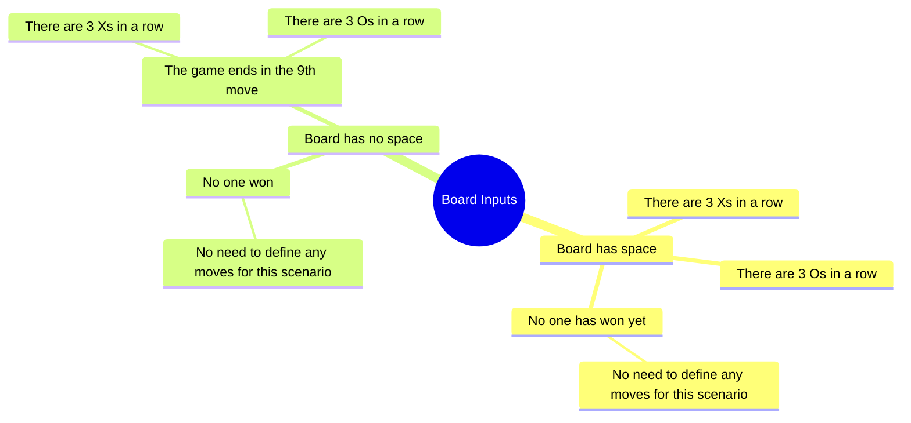
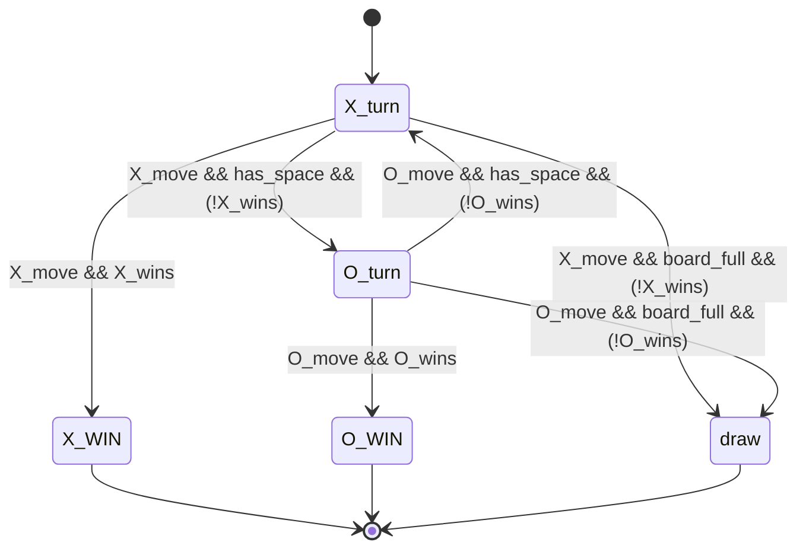
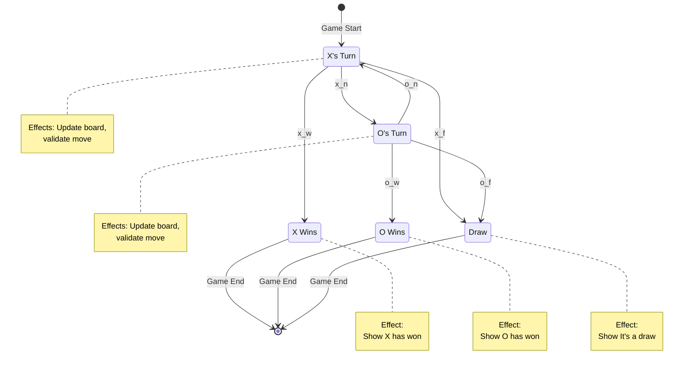

# ELI5: State Machines

The goal of this repository is not to explain the nitty-gritty of Automata Theory or in-depth design and implementation of *Finite State Machines*. The idea is to understand what a state machine is. And, we will choose a very simple problem "Tic-Tac-Toe" to understand it.

## The problem

I am part of a book-reading club where we decided to pick up some FP in general and wanted to get good at programming. The end goal was to explore FP with an intention of `How to think about a programming problem?`.

So, we decided to read the _Wizard Book_ SICP (Structure and Interpretation of Computer Programs).

Now, folks in the club included people with no formal CS Education working as Web Developers. And one of the frictions before we read the book were, fundamental ideas like:

1. What is state?
2. Why are we modelling problems as states in the first place?
3. What do we mean when we say "In FP, state belongs to the function"?

Thus, I thought to cook up a small tutorial explaining the same. The very minimal idea of a `State Machine`.

## Some homework for the reader

1. Convert this code to an FP approach: (A functional first programming language like Haskell, OCaml, LISP, Scheme or Clojure is preferred but not mandatory).
2. Start reading more about FP.
3. Read about `side-effects` in Programming.

## Audience

1. People who are just learning to code. (You must know the basics of any programming language, we will use Python here for explaination.)
2. People who are into building applications but have very little exposure to formal CS Education.
3. People who read `Automata Theory` just to pass exams but never understood what it really is.

## First things first

### What is a state?

**Quick Definition:** A state is a specific condition, status, or mode a system can be in at any given time. It represents a snapshot of the system's situation—like "playing," "paused," or "stopped" for a video player. The system waits in this state for an event to trigger a change (called a transition) to another state. A state machine can only be in one state at once, and these states define what actions can occur and how the system behaves when different inputs (events) are received.

Now let's dig deeper with an example.

Suppose we have a problem `P` and to solve this problem we write a program. This program executes on a machine that we call "COMPUTER".

Now, in this mental model, we assume, that a "COMPUTER" is a "MACHINE" (`M`) that is just designed to solve the problem `P`. 

Now, this is not factually accurate, the idea is to just solve the problem. 

Forget about COMPUTER PROGRAMMING, PROGRAMS, and all the fancy stuff, for now, it is just: 

1. The problem `P`, and,
2. The Machine `M` that is just designed to solve this problem `P`.

And, whenever we are writing programs to solve a problem `P` we are essentially creating a machine `M` that just solves this problem.

This machine `M` is called for a better term `A State Machine` (they are of many types, FSMs, Turing Machine, PDAs etc., but learning about them is not the goal here.). 

Now for the sake of an example, 

Let us suppose we want to create a machine that just lets two players play _Tic-Tac-Toe_.

Now, how do I model this as a problem?

```
What we know?
---------------

1. Tic-Tac-Toe is a game, with two players X and O and a 3x3 grid as follows

_ _ _ 
_ _ _
_ _ _ 

2. When game starts X moves first.

X _ _ 
_ _ _ 
_ _ _ 

3. Next O moves

X _ _ 
O _ _ 
_ _ _ 

4. Now X and O alternate turns until one of the conditions is satisfied

==> Condition 1: X has won. (i.e. 3 Xs align in any row, any column or the diagonal)

_ _ _      _ X _     X _ _       _ _ X
X X X      _ X _     _ X _       _ X _ 
_ _ _      _ X _     _ _ X       X _ _ 

==> Condition 2: O has won (i.e. 3 Os align in any row, any column or the diagonal)

_ _ _      _ O _     O _ _       _ _ O
O O O      _ O _     _ O _       _ O _ 
_ _ _      _ O _     _ _ O       O _ _ 

===> Condition 3: No Space left on the grid (i.e. Draw)

O X O
O X X 
X O X 

Thought Process
----------------- 

Now how can we construct this as a problem?

P: Given a game of tic-tac-toe determine, whether the game is still running, 
   or X has won, or O has won or Draw. 

How do we know the above?

We need a description to describe "How the game looks like at a given time?"

And this will be fed as a description to this Machine.

How do I describe this?

Well this is what a state is!
==> We model these conditions of how the game looks like as states.
==> The **system** is Tic-Tac-Toe itself (the game with all its rules and behaviors)
==> A **state** is a snapshot that captures what condition the system is in at a specific moment
==> Each state (like "X's turn", "O's turn", "X won", "O won", "Draw") represents a specific condition the game can be in
==> The game transitions from one state to another based on events (like "X places a mark" or "O places a mark")
==> At any moment, the game is in exactly ONE of these states
```

## Describing Tic-Tac-Toe as states

Now that is out of the way, let's try to model this system as set of states. To do this we will write in how many combinations and permutations we can describe the system.

1. The game has started and it's X's turn. i.e. X will play the next move. And board is empty.
2. The game is still running and it is O's turn. i.e. O will play the next move.
3. The game is still running and it is X's turn. i.e. X will play the next move.
4. The game is a draw.
5. There are 3 Xs in any of the rows. i.e. X has won
6. There are 3 Xs in any of the cols. i.e. X has won
7. There are 3 Xs in the diagonal. i.e. X has won
8. There are 3 Os in any of the rows. i.e. O has won
9. There are 3 Os in any of the cols. i.e. O has won
10. There are 3 Os in the diagonal. i.e. O has won

Now, we will try to use all the descriptions to come up with more specific states:

1. Board is empty: Start State (`S`) needs to be defined 
2. X's turn to play next: `X_turn` → We will set this as start state `S`
3. O's turn to play next: `O_turn`
4. No Space left on the board, and No one has won: `DRAW` → This is also an END State
5. There are 3 Xs in any row, col, or diagonal: `X_WON` → This is also an END State
6. There are 3 Os in any row, col, or diagonal: `O_WON` → This is also an END State

> When a machine just starts execution it is said to be in the `Start State`.
> When a machine reaches a state say `T` and halts execution it is called `END State`

In our case:

1. We have 3 END STATES: `DRAW`, `X_WON`, `O_WON`
2. Start state is, `S = X_turn`.

## Now how does the machine know where to jump into and how

Well here is where a *Transition Function:* `f(state, [inputs...]) -> (next_state, [effects...])` comes in.

A transition function is the heart and soul of the machine.

> A transition function is defined as a function which determines: For a given state and actions (`inputs`) what must be the next state the machine must jump to.

### Wait what are effects here?

So effects here describe things like: 

1. Additional outputs and changes to a configuration of a machine that happen as part of the process of solving the problem, so in other words everything apart from the `next_state`.
2. An example of such effects could be: 
   - Pushing a stack
   - Printing output to screen
   - Moving Tape left or right in a turing machine (_I intentionally mentioned it to spark curiosity. Do search about it later_)
   - Updating the board with the new move
   - etc.

### What are inputs here?

Inputs in this case are moves that happen in a game.

In Formal Automata Theory, we refer to this as `Input Symbols` and these Symbols belong to a `Language`. You don't need to worry about it now.

For now, just understand this:

```
An Input happens --> Transition Function Activates --> Machine accordingly moves to next state.
```

### Let us define our inputs now

In real working game of _Tic-Tac-Toe_ the user inputs his/her move. And, this is the ultimate input.

Now we can represent all the combinations of inputs that can be produced (_Quick math puzzle: Can you tell how many valid inputs can be produced in a given game of Tic Tac Toe?_). But, even without thinking deeply, we know we can represent these into few major types.



#### Now think of ways we can represent them

Now that we know our states, we will try to etch the first imperfect version of our state machine.

We will use a set of statements to describe initially:

```
X_move = "X performed a move"
O_move = "O performed a move"
has_space = "The board has space"
board_full = "The board is full"
X_wins = "The given board has 3 Xs in any row, any col, or diagonal"
O_wins = "The given board has 3 Os in any row, any col, or diagonal"

Convention to read the state machine:

&& -> LOGICAL AND
|| -> LOGICAL OR
!  -> LOGICAL NOT

So a statement like:
X_move && has_space && (!X_wins) can be read as:

"X performed a move AND the board has space AND X has not won"

This means: X made a valid move, there are still empty cells on the board,
and this move didn't result in X winning the game.
```



Now we will use this diagram to write out states in a condensed format:

```
states = {
  x_n,   // X move, no win, board not full
  x_w,   // X move, X wins
  x_f,   // X move, board full, no win (draw)
  o_n,   // O move, no win, board not full
  o_w,   // O move, O wins
  o_f    // O move, board full, no win (draw)
}
```

## Transition Table

Now we can define our transition function as a mapping from inputs to outputs. This activity is very important for concept building at this stage and will also help us write better and testable functions when we write actual programs.

> Fun Fact (for the curious):<br/>In this case, the effects do not influence the execution of the machine; they are merely outputs. As a result, the problem is modeled using a Finite State Machine (FSM). Since the outputs are associated only with the current state and not with the transitions, this is a variation of a Moore machine.


| Current State | Input Condition | Next State | Effect |
|---------------|----------------|------------|---------|
| X_turn | X makes move, X wins | X_WIN | Update board, display "X wins!" |
| X_turn | X makes move, board becomes full, no win | DRAW | Update board, display "It's a draw!" |
| X_turn | X makes move, has space, no win | O_turn | Update board |
| O_turn | O makes move, O wins | O_WIN | Update board, display "O wins!" |
| O_turn | O makes move, board becomes full, no win | DRAW | Update board, display "It's a draw!" |
| O_turn | O makes move, has space, no win | X_turn | Update board |
| X_WIN | NA | NA | Display "Game over, X won!" |
| O_WIN | NA | NA | Display "Game over, O won!" |
| DRAW | NA | NA | Display "Game over, it's a draw!" |

## Formalized State Machine Diagram

Now we will use this to write out our state machine in a better and more formalized format:



> Just remember this concept for now, later it will be very helpful in understanding `side-effects` in programming and functional programming paradigms.


## And we have our machine ready.

Now that we have a machine, we will turn this into functioning code. We could have created the code alongside, but I meant to avoid any fundamental errors while trying to oversimplify things. 

Next section, we will add how we can implement this thought process in code. 


## Translating State Machine to Code

Now that we have our state machine designed, let's translate it into working code. We'll focus on how each part of our state machine maps to code structures.

### Part 1: Types - Defining States and Inputs

In our state machine diagram, we identified:
- **States**: `X_turn`, `O_turn`, `X_WIN`, `O_WIN`, `DRAW`
- **Inputs**: `x_n`, `x_w`, `x_f`, `o_n`, `o_w`, `o_f`

These become **types** in our code:

```python
class State(Enum):
    X_turn = "state_x_turn"
    O_turn = "state_o_turn"
    X_win = "state_x_win"
    O_win = "state_o_win"
    Draw = "state_draw"

class Move(Enum):
    x_n = "x_n"  # X moves, no winning, board not full
    x_w = "x_w"  # X moves, X wins
    x_f = "x_f"  # X moves, board full, no win
    o_n = "o_n"  # O moves, no winning, board not full
    o_w = "o_w"  # O moves, O wins
    o_f = "o_f"  # O moves, board full, no win
```

**The parallel**: Every state in our diagram becomes a value in the `State` type. Every input symbol becomes a value in the `Move` type. This gives us a vocabulary to talk about our machine in code.

We also need to represent our players:

```python
class Player(Enum):
    X = "X"
    O = "O"
```

### Part 2: The Transition Function

Remember our transition table? Each row described: "If you're in state `S` and input `I` occurs, move to state `S'`"

| Current State | Input | Next State |
|---------------|-------|------------|
| X_turn | x_w | X_WIN |
| X_turn | x_f | DRAW |
| X_turn | x_n | O_turn |
| O_turn | o_w | O_WIN |
| O_turn | o_f | DRAW |
| O_turn | o_n | X_turn |

This table **is** our transition function. In code:

```python
def transition(curr_state, move):
    return {
        (State.X_turn, Move.x_n): State.O_turn,
        (State.O_turn, Move.o_n): State.X_turn,
        (State.X_turn, Move.x_f): State.Draw,
        (State.O_turn, Move.o_f): State.Draw,
        (State.X_turn, Move.x_w): State.X_win,
        (State.O_turn, Move.o_w): State.O_win,
    }.get((curr_state, move))
```

The transition function is literally a mapping from `(current_state, input) -> next_state`. Each line in the dictionary corresponds to one arrow in our state diagram.

Notice what this function does **not** do:
- It doesn't update the board
- It doesn't print anything
- It doesn't validate moves

It only answers: "Given where I am and what happened, where do I go next?"

### Part 3: Calculating Inputs from Board State

Our inputs (`x_n`, `x_w`, etc.) describe **what kind of move just happened**. But the player just gives us row and column coordinates. How do we translate a board state into an input symbol?

This is where `calc_input()` comes in:

```python
def calc_input(board, player):
    # Check if player won (check all rows, columns, diagonals)
    if player_won(board, player):
        return Move.x_w if player == Player.X else Move.o_w
    
    # Check if board is full
    if not has_space(board):
        return Move.x_f if player == Player.X else Move.o_f
    
    # Otherwise, normal move
    return Move.x_n if player == Player.X else Move.o_n
```


This function translates the **effects** (updated board configuration) into **input symbols** that our transition function understands.

Think of it as an interpreter: "The board looks like this, that means input symbol `x_w` occurred"

### Part 4: The Game Loop - Running the Machine

Our state machine operates in a loop:
1. Start in initial state (`X_turn`)
2. Wait for input
3. Transition to next state
4. Repeat until reaching end state

In code:

```python
def play():
    game_board = board()
    current_state = State.X_turn  # Initial state
    
    # Run until we reach an end state
    while current_state not in [State.X_win, State.O_win, State.Draw]:
        
        # Determine current player from current state
        current_player = Player.X if current_state == State.X_turn else Player.O
        
        # Get user input and update board (effects)
        row, col = get_user_move()
        game_board = place(game_board, row, col, current_player)
        
        # Translate board state to input symbol
        move = calc_input(game_board, current_player)
        
        # Transition to next state
        current_state = transition(current_state, move)
    
    # End state reached - display final result
    print_final_result(current_state)
```

Now if we watch closely:

- `current_state` is where our machine currently is
- User input + board update = **effects** (things that happen in the world)
- `calc_input()` = determining what **input symbol** those effects represent
- `transition()` = moving the machine to the next state
- Loop continues until `current_state` is an end state

### The beauty of thinking in state machines

The beauty of this approach is **separation**:
- **Types** (`State`, `Move`) define our vocabulary
- **Transition function** defines the rules of state changes (pure logic)
- **Effects** (board updates, printing) happen outside transitions
- **Input calculation** bridges the gap between real-world effects and symbolic inputs

### Another important Observation
1. We did not use any FP specific terminology here. 
2. We did use the word `effects` but have not even discussed about `side-effects` and our code is still very much free of `side-effects` (_Try searching about "Side Effects in Programming"_).
3. We did not get into nitty-gritties of what are formal languages, Automata, Turing Completeness etc. and we yet, have a simple mental-model now.

Your state machine is the skeleton; the effects are the flesh. The machine tells you what's happening logically, effects make it visible and interactive.

This is why state machines are powerful: they let you reason about **what states exist** and **how to move between them** separately from **what those states mean** in the real world.


# Why is this exercise important?

Many real world production systems can be naturally modeled as state machines. In fact, state machines form one of the earliest conceptual foundations of computing, long before modern computers even existed.

State machines are not limited to compilers or interpreters. They show up everywhere in practice, especially in distributed systems.

Some concrete examples of systems that are best understood through state machines are:

1. **Distributed workflows**
   Complex workflows that involve coordination across multiple services such as payment processing or order fulfillment are often modeled as state machines to make transitions and invariants explicit.

2. **Stateful infrastructure systems**
   Systems like Kafka, database replication, and consensus protocols rely heavily on state. Modeling them as state machines helps reason about correctness and, more importantly, failure modes.

3. **Formal system modeling**
   Tools like TLA+ are commonly used to model and reason about system behavior. At their core, these models are state machines. Learning to think this way makes it easier to understand and validate system guarantees.

4. **Networking and security**
   Network protocols and firewalls are effectively state machines. Components such as `netfilter` and `conntrack` track connection state to decide how packets should be handled.

Understanding state machines gives you a powerful mental model to reason about complex systems, especially when things go wrong.

# Where to go from here ?

Now you understand how a state machine translates to code:
1. Design states and transitions first (on paper/diagram)
2. Encode states and inputs as types
3. Implement transition function as a pure mapping
4. Calculate inputs from effects
5. Run the machine in a loop

Try converting this to a functional language like Clojure or Haskell—you'll find the same patterns emerge, just with different syntax. The state machine thinking transcends the language.
